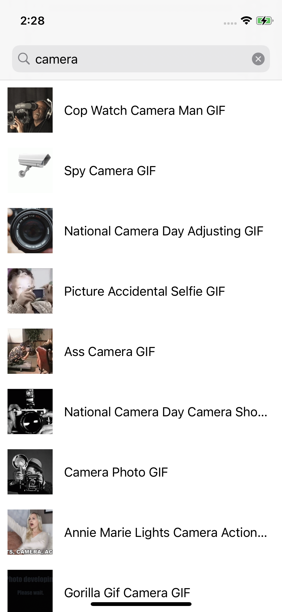
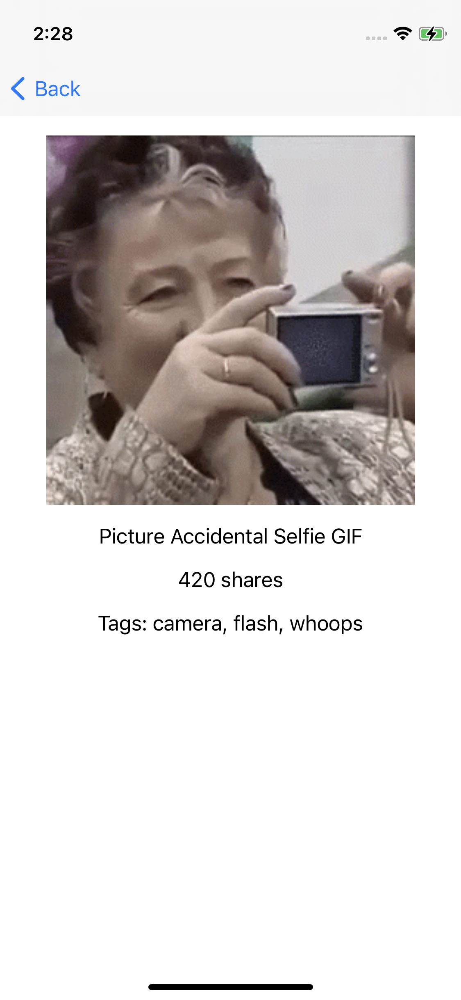

# iOS Take Home

Create an iOS app with two views, `MainViewController` and `DetailViewController`. The `MainViewController` contains a list of GIFs from the [Giphy API](https://developers.giphy.com/).

When there is no query, the view should display the featured gifs. When there is a query, it should display the search results from the API.

Tapping on a cell should push the `DetailViewController`. When the `DetailViewController` loads, it should request information from the API like title, source tld, and rating, and display it. This data must be requested from `DetailViewController`, not passed from the previous view controller (only pass the gif ID, then request data from the API again).

As much as possible, stick to the Combine ViewModel structure implemented in the `MainViewController`. The `DetailViewController` should use a similar system for loading additional information from the API.

You shouldn't need to use any additional dependencies.

And while not required, feel free to add additional flourishes or features! (For example, opening Safari to the Giphy page for that gif from a button on the detail page, or using modern UIKit APIs)

## Setup

Get an API key [here](https://developers.giphy.com/dashboard/) and put it into `Constants.swift`

## Evaluation

### What you will be evaluated on

- Functionality - can you translate the requirements into working code
- Following modern best practices
- Usage of Combine
- Usage of SnapKit for laying out views

### What you will not be evaluated on

- Testing
- Styling of views outside of functionality

## Submission Instructions

Create a public GitHub repository. Share this GitHub URL with your point of contact.

Note: The data displayed here is for demonstration purposes. You should display any data possible from the Giphy API that you can on the detail view.
